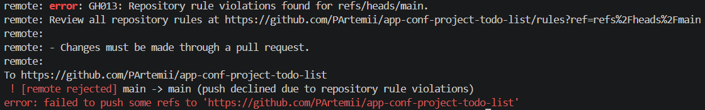

# Правила работы в команде

## 1. Стратегия ветвления

В проекте используется стратегия **GitHub Flow**, зафиксированная в ADR 001.

Основная ветка проекта — `main`. Она всегда должна оставаться стабильной и готовой к деплою.

Все изменения разрабатываются в отдельных рабочих ветках и попадают в `main` только через Pull Request.

Ветка `develop` не используется.

### Схема ветвления

```text
main:     ●────────●────────●────────●────────●
           \        \        \        \
feature/    ●───●     \        \        \
                  \     \        \        \
bugfix/             ●───● \        \        \
                           \        \        \
docs/                        ●───●     \        \
                                       \        \
                                        ●───●
```

### Правила работы с ветками

1. Ветка `main` всегда стабильна и готова к деплою.
2. Каждая новая функциональность разрабатывается в отдельной ветке `feature/[название-фичи]`.
3. Исправления ошибок выполняются в отдельных ветках `bugfix/[название-исправления]`.
4. Перед merge в `main` обязателен Pull Request с минимум **1 Approve от другого участника команды**.
5. Сообщения коммитов следуют соглашению **Conventional Commits**.
6. Рабочие ветки удаляются после merge.

### Рабочий процесс

Перед началом работы необходимо получить актуальную версию `main`:

```bash
git checkout main
git pull origin main
```

Для новой задачи создаётся отдельная ветка:

```bash
git checkout -b <тип>/<название>
```

После выполнения задачи изменения фиксируются коммитом и отправляются в удалённый репозиторий:

```bash
git add .
git commit -m "<type>: <description>"
git push -u origin <имя-ветки>
```

После этого создаётся Pull Request в ветку `main`.

Прямой push в `main` запрещён. Все изменения в `main` вносятся через Pull Request после Code Review.

---

## 2. Правила именования веток

Для каждой отдельной задачи создаётся отдельная ветка.

Шаблон имени ветки:

```text
<тип>/<краткое-название-задачи>
```

Используются следующие префиксы:

- `feature/` — новая функциональность;
- `bugfix/` — исправление ошибки;
- `docs/` — изменение документации;
- `refactor/` — рефакторинг кода;
- `test/` — добавление или изменение тестов.

Название ветки должно:

- быть написано в нижнем регистре;
- кратко описывать выполняемую задачу;
- использовать дефисы для разделения слов;
- не содержать пробелов.

Примеры корректных названий:

```text
feature/version-endpoint
bugfix/task-validation
docs/contributing-rules
refactor/task-service
test/health-endpoint
```

Для задачи «добавить эндпоинт `/version`» используется ветка:

```text
feature/version-endpoint
```

---

## 3. Правила коммитов

В проекте используется соглашение **Conventional Commits**.

Формат сообщения коммита:

```text
<type>: <description>
```

Используемые типы:

- `feat` — добавление новой функциональности;
- `fix` — исправление ошибки;
- `docs` — изменение документации;
- `style` — изменение форматирования без изменения логики;
- `refactor` — рефакторинг кода;
- `test` — добавление или изменение тестов;
- `chore` — технические и инфраструктурные изменения.

Примеры:

```text
feat: add version endpoint
fix: validate empty task title
docs: update contributing rules
refactor: simplify task creation
test: add health endpoint test
```

Описание коммита должно кратко и понятно отражать выполненное изменение.

Один коммит не должен объединять несколько несвязанных задач.

### Примеры коммитов из репозитория

Примеры реальных коммитов из истории проекта:

```text
docs: add ADR 001 about Git branching strategy
feat: add initial FastAPI application with health check
```

Эти сообщения можно найти в истории репозитория с помощью команды:

```bash
git log
```

---

## 4. Регламент Code Review

Все изменения в `main` проходят через Pull Request.

Автор Pull Request не может одобрить собственный PR.

Для каждого Pull Request:

- назначается минимум один ревьюер из числа других участников команды;
- требуется минимум **1 Approve от другого участника команды**;
- должен быть заполнен PR-шаблон;
- должно быть понятно описано, что было изменено;
- должна быть указана инструкция по проверке изменений;
- все замечания ревьюеров должны быть обработаны до merge;
- PR не должен содержать неразрешённых конфликтов.

### Срок Code Review

После назначения ревьюер должен провести первичное Code Review в течение **24 часов**.

Если ревьюер оставил комментарии или выбрал **Request changes**, автор Pull Request должен:

1. Ознакомиться со всеми замечаниями.
2. Исправить замечания или ответить на комментарий, если требуется обсуждение.
3. Отправить исправления в ту же ветку Pull Request.
4. Сообщить ревьюеру о готовности изменений к повторной проверке.

После внесения исправлений ревьюер повторно проверяет Pull Request.

### Обязанности автора Pull Request

Перед отправкой PR на review автор должен:

- убедиться, что приложение запускается;
- проверить изменённую функциональность;
- убедиться, что изменение соответствует поставленной задаче;
- проверить отсутствие `.env`, токенов, паролей, ключей и других секретных данных;
- проверить отсутствие временных и отладочных файлов;
- обновить документацию, если изменение влияет на использование проекта;
- заполнить описание Pull Request;
- указать способ проверки изменений.

### Обязанности ревьюера

Ревьюер проверяет:

- соответствует ли реализация поставленной задаче;
- запускается ли проект после изменений;
- работает ли добавленная или изменённая функциональность;
- понятен ли изменённый код;
- соблюдаются ли правила проекта;
- отсутствуют ли секретные данные;
- отсутствуют ли временные и отладочные файлы;
- обновлена ли документация, если это необходимо;
- заполнено ли описание Pull Request;
- указана ли инструкция по проверке изменений.

---

## 5. Критерии Approval

Ревьюер ставит **Approve**, если выполнены все следующие условия:

1. Изменения соответствуют поставленной задаче.
2. Проект запускается после внесённых изменений.
3. Изменённая или добавленная функциональность работает.
4. Все замечания ревьюера исправлены или закрыты после обсуждения.
5. В Pull Request отсутствуют неразрешённые конфликты с `main`.
6. В Pull Request отсутствуют секретные данные.
7. В Pull Request отсутствуют лишние, временные и отладочные файлы.
8. Документация обновлена, если изменение влияет на использование проекта.
9. Pull Request содержит понятное описание изменений.
10. В Pull Request указано, как проверить внесённые изменения.

Для merge требуется минимум **1 Approve от другого участника команды**.

Автор Pull Request не может одобрить собственный PR.

---

## 6. Разрешение конфликтов в коде

Если рабочая ветка конфликтует с `main`, автор Pull Request должен разрешить конфликт перед merge.

### Порядок действий

Получить актуальное состояние удалённого репозитория:

```bash
git fetch origin
```

Перейти в рабочую ветку:

```bash
git checkout <имя-ветки>
```

Получить изменения из актуальной ветки `main`:

```bash
git merge origin/main
```

Если Git сообщает о конфликтах:

1. Открыть конфликтующие файлы.
2. Найти участки, отмеченные Git маркерами `<<<<<<<`, `=======` и `>>>>>>>`.
3. Выбрать правильную версию или вручную объединить изменения.
4. Удалить маркеры конфликта.
5. Сохранить файлы.
6. Проверить работоспособность проекта.

После разрешения конфликтов выполнить:

```bash
git add .
git commit -m "fix: resolve merge conflicts"
git push
```

После `git push` Pull Request обновится автоматически.

Автор должен повторно проверить работоспособность проекта после разрешения конфликтов.

Если после разрешения конфликта появились новые замечания ревьюера, они обрабатываются по обычным правилам Code Review.

### Организационные разногласия

Если участники команды не могут договориться:

1. Вопрос обсуждается в командном чате или на встрече.
2. Каждый участник может предложить свой вариант решения.
3. Если договориться не удалось, проводится голосование большинством голосов.
4. Если команда не может принять решение самостоятельно, вопрос передаётся преподавателю.

---

## 7. Защита ветки main

Для защиты основной ветки `main` используется GitHub Ruleset с названием **`protect-main`**.

Ruleset применяется к ветке `main` и предназначен для защиты основной ветки от изменений, не прошедших установленный командой процесс проверки.

Изменения в `main` вносятся через Pull Request после прохождения Code Review.

### Настроенные правила защиты

В Ruleset `protect-main` для ветки `main` настроены следующие требования:

- изменения в `main` выполняются через Pull Request;
- перед merge требуется минимум **1 Approve от другого участника команды**;
- прямые изменения защищённой ветки ограничены;
- Pull Request должен соответствовать установленным требованиям перед merge.

### Проверка защиты ветки

После настройки Ruleset `protect-main` выполняется проверка невозможности прямого push в ветку `main`.

Для проверки выполняется попытка прямого push:

```bash
git push origin main
```

Прямой push должен быть отклонён правилами Ruleset `protect-main`.

Скриншот с фактическим сообщением об отказе необходимо сохранить в репозитории по пути:

```text
docs/branch-protection-check.png
```

После добавления скриншота результат проверки отображается ниже:



### Required status checks

> **TODO (модуль 3, практика №5):** после появления CI-пайплайна включить в ruleset `protect-main` правило **Require status checks to pass** и добавить в список обязательных проверок джобы линтера и тестов. До этого момента зелёный пайплайн не является условием merge.

---

## Встречи команды

- Частота встреч: **2 раза в неделю**.
- Примерное время: **вторник и пятница в 18:00**.
- Основной канал связи: **Telegram**.
- Ожидаемое время ответа на сообщения: **в течение 24 часов в рабочие дни**.

Во время встреч команда обсуждает:

- выполненные задачи;
- текущие задачи;
- возникшие проблемы;
- Pull Request и результаты Code Review;
- распределение следующих задач;
- дальнейшие действия команды.

При необходимости дополнительные вопросы обсуждаются в командном чате вне плановых встреч.

---

## 8. Контакты команды

- Тимлид: **София Нестругина**, Telegram: `@sonya_s_tortom`
- Tech Lead: **Пугач Артемий**, Telegram: `@ArtemiyOwl`
- CI/CD & Quality: **Чубаркина Екатерина**, Telegram: `@Katherinewss`
- Deployment & Documentation: **Панова Наталья**, Telegram: `@Natasha_Panova005`

**Основной канал связи:** Telegram.  
**Время ответа:** в течение **24 часов в рабочие дни**.

По вопросам организации работы команды следует обращаться к **тимлиду**.

По вопросам архитектуры и технических решений — к **Tech Lead**.

По вопросам CI/CD, автоматических проверок и качества — к **CI/CD & Quality**.

По вопросам деплоя и документации — к **Deployment & Documentation**.

Вопросы по конкретным изменениям кода обсуждаются непосредственно в соответствующем **GitHub Pull Request**.