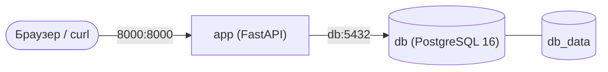

# Схема окружения проекта

**Команда:** 404  
**Проект:** To-Do List API — REST API для управления задачами с регистрацией и JWT-аутентификацией.  
**Дата:** 2026-09-30

## 0. Кто что делал

| Участник | Роль на воркшопе | Что конкретно сделал |
|---|---|---|
| Нестругина София | Архитектор схемы | Нарисовала схему сервисов, проверила сеть Compose и том БД |
| Пугач Артемий | Ведущий таблицы сервисов | Заполнил таблицу сервисов, проверил адрес подключения приложения к БД |
| Панова Наталья | Автор ADR 002 | Подготовила сравнение pip + `requirements.txt`, Poetry и uv, оформила ADR 002 |
| Чубаркина Екатерина | Рецензент | Проверила схему другой команды по чек-листу, заполнила раздел 4 |

## 1. Схема

## 2. Таблица сервисов

| Сервис | Образ или сборка | Порты `хост:контейнер` | Переменные окружения (только имена, без значений) | Тома | Зависит от (условие) | Healthcheck |
|---|---|---|---|---|---|---|
| `app` | `build: .` — Dockerfile появится на практике №3; базовый образ `python:3.11-slim`; менеджер зависимостей — по ADR 002 | `8000:8000` | `DATABASE_URL`, `SECRET_KEY`, `ACCESS_TOKEN_EXPIRE_MINUTES`, `ALGORITHM` | — | `db` — `service_healthy` | — |
| `db` | `postgres:16` | не публикуется наружу | `POSTGRES_USER`, `POSTGRES_PASSWORD`, `POSTGRES_DB` | `db_data:/var/lib/postgresql/data` | — | `pg_isready -U $POSTGRES_USER -d $POSTGRES_DB` |

Дополнительных сервисов сверх двух нет.

**Примечания:**

- Порт `5432` наружу не публикуется. Для отладки БД — `docker compose exec db psql -U $POSTGRES_USER -d $POSTGRES_DB`.
- Healthcheck у `app` появится на практике №3 — либо через Python-скрипт (`urllib.request`), либо после добавления `curl` в образ. На текущем этапе в таблице — прочерк.
- Менеджер зависимостей для сборки образа `app` — по ADR 002.

## 3. Ответы на контрольные вопросы

1. **Адрес базы.** Приложение подключается к БД по адресу `db` — это имя сервиса в `compose.yaml`.  
   Шаблон строки подключения: `postgresql://[пользователь]@db:5432/[база]`.  
   Пароль приложение получает из переменной `DATABASE_URL`; сама БД — из `POSTGRES_PASSWORD`.

2. **Судьба данных.**  
   `docker compose down` удаляет контейнеры и сеть, но именованный том `db_data` сохраняется — данные БД остаются.  
   `docker compose down -v` удаляет и том `db_data` — данные БД теряются.

3. **Образ и запуск.**  
   При сборке образа приложения внутрь попадают: код, зависимости, системные пакеты, entrypoint.  
   При запуске контейнера передаются: переменные окружения, опубликованные порты, тома, сеть, команда/параметры запуска.  
   Секреты в образ не записываются.

4. **Миграции.**  
   Гипотеза: схема БД создаётся через Alembic. Вариант — entrypoint приложения выполняет `alembic upgrade head` перед запуском `uvicorn`; альтернатива — отдельный one-shot сервис `migrate`, который зависит от `db` с условием `service_healthy`. Проверяется на практике №3.

5. **Запуск и проверка.**  
   Команда запуска: `docker compose up --build -d`.  
   Команда запуска приложения внутри контейнера: `uvicorn main:app --host 0.0.0.0 --port 8000`.
   Проверка: `curl http://localhost:8000/health` — ожидаемый ответ `{"status":"healthy"}`.  
   Дополнительно: `curl http://localhost:8000/version` — ожидаемый ответ `{"version":"0.2.0","team":"404"}`.

## 4. Проверка схемы другой командой

**Команда-рецензент:** Что-то на IT'шном 
**Рецензент:** https://gitlab.com/Jaymevol/worktrack

### Как проверять: 8 минут

| Время | Что делать |
|---|---|
| 1 мин | Прочитать схему целиком, молча. Понять, что за приложение и из каких сервисов оно состоит. Вопросов пока не задавать |
| 3 мин | Пройти чек-лист сверху вниз. По каждому критерию найти в схеме конкретное место. Нашли и всё верно — ✅. Не нашли или неверно — ❌. Нашли, но сомневаетесь — ⚠️ и вопрос авторам |
| 1 мин | **Холодное чтение.** Представить, что на практике №3 вы пишете compose-файл по этой схеме, а авторов рядом нет. Записать, чего не хватило |
| 2 мин | Из ❌ и ⚠️ выбрать до двух главных замечаний. Нет ни ❌, ни ⚠️ — написать «Блокирующих замечаний нет» |
| 1 мин | Записать рекомендацию или вопрос за пределами чек-листа. Проверить, что вписаны имя и логин |

### Чек-лист

| № | Критерий | Где смотреть | Оценка | Комментарий |
|---|---|---|---|---|
| 1 | В стеке есть приложение и PostgreSQL; каждый дополнительный сервис обоснован | Раздел 2: строки сервисов; у каждого сверх двух — фраза «зачем» | ✅ | Раздел 2, строки `app` и `db`. Дополнительных сервисов нет, обосновывать нечего. Проект — FastAPI + Postgres, соответствует описанию в шапке |
| 2 | Версия образа БД зафиксирована (не `latest` и не без тега) | Раздел 2, строка БД, колонка «Образ»: после двоеточия — конкретная версия | ✅ | Раздел 2, строка `db`: `postgres:16` — версия зафиксирована |
| 3 | Приложение обращается к БД по адресу, который работает **внутри** сети Compose | Раздел 3, вопрос 1: хост в строке подключения сравнить с именами сервисов в разделе 2 | ✅ | Раздел 3, вопрос 1: хост `db` — совпадает с именем сервиса в разделе 2, строка `db` |
| 4 | Данные БД хранятся в именованном томе, путь монтирования соответствует версии PostgreSQL | Раздел 2, строка БД, колонка «Тома»: у тома есть имя; путь сверить с версией образа по описанию образа postgres (раздел PGDATA) | ✅ | Раздел 2, строка `db`: том `db_data`, путь `/var/lib/postgresql/data` — корректно для `postgres:16` (официальный образ) |
| 5 | Приложение стартует только после того, как БД готова (условие в зависимости + healthcheck у БД) | Раздел 2: у приложения колонка «Зависит от» — с условием; у БД колонка «Healthcheck» заполнена | ✅ | Раздел 2, строка `app`: `db — service_healthy`. Строка `db`: `pg_isready -U $POSTGRES_USER -d $POSTGRES_DB`. Оба условия на месте |
| 6 | Наружу опубликованы только нужные порты; для каждого опубликованного порта понятно, зачем | Раздел 2, колонка «Порты»: для каждого порта — кто к нему ходит снаружи | ⚠️ | Раздел 2, строка `app`: `8000:8000` — понятно, снаружи ходят браузер/curl. Строка `db`: «не публикуется наружу» — верно, но **не сказано, как отлаживать БД** (через `docker compose exec db psql`). См. главное замечание №1 |
| 7 | Переменные окружения перечислены по именам, значений секретов в схеме нет | Раздел 2, колонка переменных; раздел 3, вопрос 1: нигде нет паролей | ✅ | Раздел 2: переменные перечислены по именам, значений нет. Раздел 3, вопрос 1 — только шаблон и имя переменной `POSTGRES_PASSWORD`, без значения |
| 8 | Есть ответ, как создаётся схема БД при первом запуске | Раздел 3, вопрос 4 (гипотеза допустима) | ✅ | Раздел 3, вопрос 4: указана гипотеза через Alembic + два варианта запуска (entrypoint или one-shot сервис). Гипотеза допустима |
| 9 | Стек поднимается одной командой, есть проверяемый признак успешного запуска | Раздел 3, вопрос 5: команда и что именно проверить после неё | ✅ | Раздел 3, вопрос 5: `docker compose up --build -d` + `curl http://localhost:8000/health` с ожидаемым `{"status":"healthy"}`. Дополнительно `/version` |

**Главные замечания** — до двух, по формуле «где → что не так → чем грозит → что предлагаете». Если блокирующих проблем нет, напишите вместо них: «Блокирующих замечаний нет».

1. Раздел 2, строка `db`, колонка «Порты»: указано «не публикуется наружу», но не сказано, как отлаживать БД. На практике №3 команда не сможет проверить, что миграции применились, и не поймёт, публиковать ли порт `5432` для отладки. Предлагаем добавить примечание под таблицей: «Порт `5432` наружу не публикуется; для отладки — `docker compose exec db psql -U $POSTGRES_USER -d $POSTGRES_DB`».

2. Раздел 2, строка `app`, колонка «Healthcheck»: стоит прочерк, но при этом в разделе 2 не сказано, как проверить живость приложения внутри стека (внешний `curl` из раздела 3 не покрывает случай, когда контейнер `app` крутится, но `uvicorn` не поднялся). На практике №3 при использовании `depends_on` с `service_healthy` от `app` не будет условия, на которое можно опереться. Предлагаем либо зафиксировать, что healthcheck у `app` не нужен (тогда явно написать это в примечании), либо добавить healthcheck через `python -c "import urllib.request; urllib.request.urlopen('http://localhost:8000/health')"` — без `curl`, которого в `python:3.11-slim` нет.

**Холодное чтение.** Смогли бы вы написать compose-файл по этой схеме, не спрашивая авторов? Чего не хватило?

- Не хватило **точных имён переменных окружения**, сверенных с `.env.example`. `SECRET_KEY`, `ALGORITHM`, `ACCESS_TOKEN_EXPIRE_MINUTES` — типовые для FastAPI+JWT, но в проекте могут называться иначе. Без сверки на практике №3 есть риск передать приложению неправильные имена и получить `KeyError` на старте.
- Не хватило **команды запуска приложения** внутри контейнера: `uvicorn main:app --host 0.0.0.0 --port 8000`. В схеме указан порт, но не сказано, что `uvicorn` слушает именно его.
- Не хватило **точного значения `DATABASE_URL`** — в схеме только шаблон `postgresql://[пользователь]@db:5432/[база]`. На практике это поле нужно заполнить конкретно, и неясно, какая БД (`POSTGRES_DB`) и какой пользователь.

**Рекомендация или вопрос** за пределами чек-листа:

- Зафиксировать в схеме, каким менеджером зависимостей ставится приложение в Dockerfile. Это связано с ADR 002, который пишется параллельно, и повлияет на практику №3 (например, `uv sync --frozen` vs `poetry install`). Если ADR 002 выберет uv, а в схеме образа останется `python:3.11-slim` + `pip`, команде придётся переделывать Dockerfile. Лучше согласовать сейчас.

## 5. Что изменено по замечаниям

| Замечание или рекомендация | Что изменили, почему не согласны или учтёте ли рекомендацию |
|---|---|
| Раздел 2, строка `db`, колонка «Порты»: не сказано, как отлаживать БД | Учли. Добавили примечание под таблицей сервисов: «Порт `5432` наружу не публикуется. Для отладки — `docker compose exec db psql -U $POSTGRES_USER -d $POSTGRES_DB`». Раздел 2 обновлён |
| Раздел 2, строка `app`, колонка «Healthcheck»: прочерк, не сказано, как проверять живость приложения | Учли частично. Healthcheck у `app` на этом этапе **не добавляем**: в образе `python:3.11-slim` нет `curl`, а тянуть его ради одной проверки считаем избыточным. Явно зафиксировали это в примечании: «Healthcheck у `app` появится на практике №3 — либо через Python-скрипт (`urllib.request`), либо после добавления `curl` в образ». Раздел 2 дополнен примечанием |
| Холодное чтение: не хватило точных имён переменных окружения, сверенных с `.env.example` | Учли. Сверили имена с `.env.example` проекта: `SECRET_KEY`, `ALGORITHM`, `ACCESS_TOKEN_EXPIRE_MINUTES` — соответствуют. `DATABASE_URL` собирается из `POSTGRES_USER`, `POSTGRES_PASSWORD`, `POSTGRES_DB`. Раздел 2 не меняем |
| Холодное чтение: не хватило команды запуска приложения внутри контейнера | Учли. Добавили в раздел 3, вопрос 5: команда запуска внутри контейнера — `uvicorn main:app --host 0.0.0.0 --port 8000`. Раздел 3 обновлён |
| Холодное чтение: не хватило точного значения `DATABASE_URL` | Учли частично. В схеме оставляем шаблон `postgresql://[пользователь]@db:5432/[база]` — конкретные значения задаются через `.env` и в схему не попадают (критерий 7: без секретов). В разделе 3, вопрос 1 добавили пояснение: «конкретные значения `[пользователь]` и `[база]` берутся из `POSTGRES_USER` и `POSTGRES_DB`» |
| Рекомендация: согласовать менеджер зависимостей с ADR 002 | Учли. Решение по менеджеру зависимостей (`uv` или `Poetry`) фиксируется в ADR 002. В схему добавили ссылку: «Менеджер зависимостей — по ADR 002». Раздел 2 обновлён |

## 6. После воркшопа

Раздел не заполняется — это домашнее задание к практике №3. Схема и ADR 002 живут в разных ветках. Имена веток — по правилам из `CONTRIBUTING.md`.